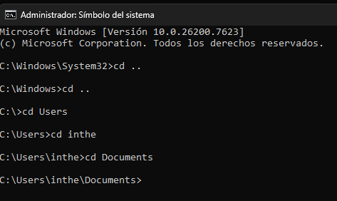
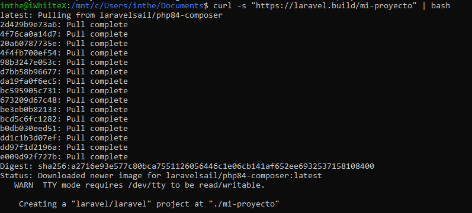
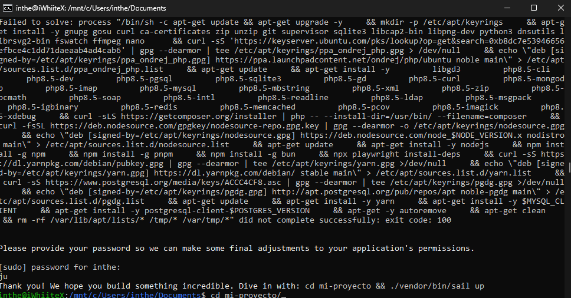
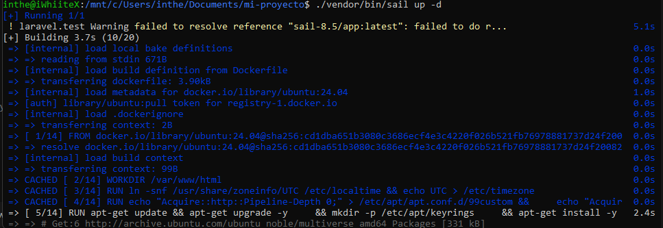
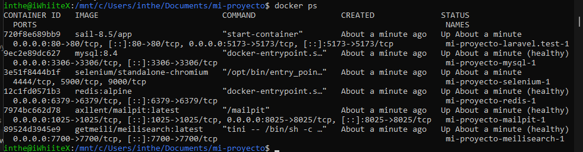
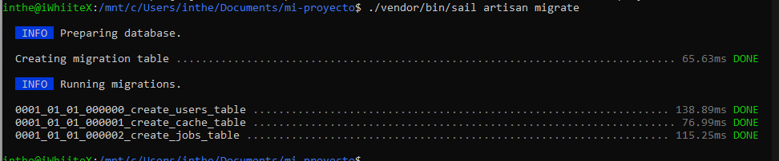
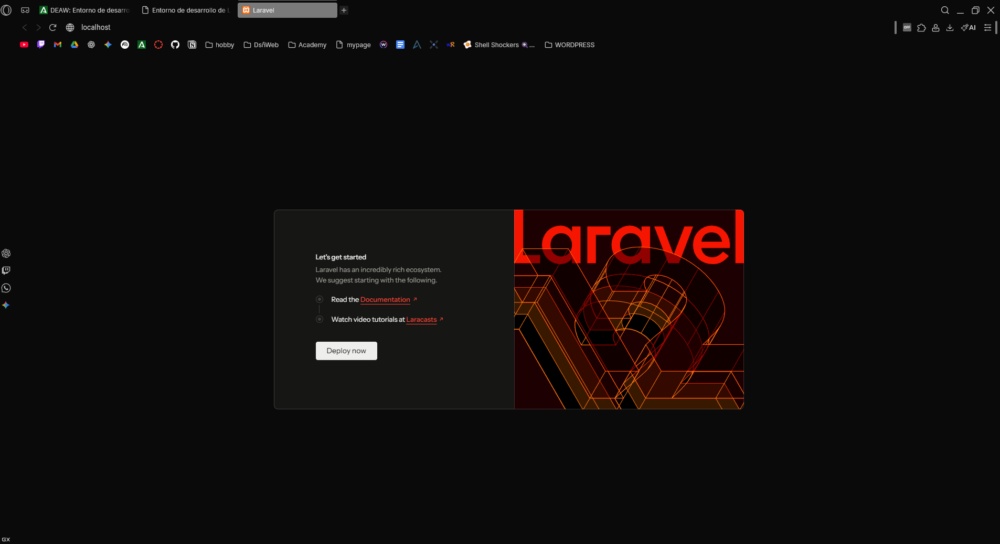

# Entorno de desarrollo Laravel con Sails
 - Docker desktop iniciado
 - Terminal o consola
 - WSL 2 
## Crear proyecto laravel
- Buscamos ruta donde vamos a quereer iniciar proyecto nosotros va a ser en Documentos, para esto abrimos la terminal y accedemos a ella

- Usamos el comando wsl para acceder a terminar linux.
- Ejecutamos " curl -s "https://laravel.build/mi-proyecto" | bash " donde mi proyecto puede ser el nombre que queramos

- accedemos al proyecto 

- Iniciamos el entorno de contenerdores por primera vez " ./vendor/bin/sail up -d "

- comprobamos con docker ps 

## Ejecutamos migraciones 
- Ejecutamos migraciones  "./vendor/bin/sail artisan migrate"

- Y nos dirigiomos a  http://localhost

